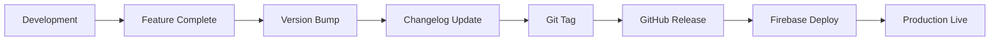

# 📝 Version Management Guide - Budget Buddy

**Current Version**: `2.5.4`  
**Last Updated**: August 23, 2025  
**Versioning Strategy**: Semantic Versioning with Automated Changelog

## 📋 Overview

Budget Buddy follows [Semantic Versioning](https://semver.org/) with comprehensive automation for version bumping, changelog management, and release documentation. This guide outlines the complete workflow for maintaining version consistency across the application.

## 🔢 Semantic Versioning Strategy

### **Format: `MAJOR.MINOR.PATCH`**

| Version Type | Format | When to Use | Examples |
|--------------|--------|-------------|----------|
| **🔴 MAJOR** | X.0.0 | Breaking changes, complete rewrites, API changes | 1.0.0 → 2.0.0 |
| **🟡 MINOR** | X.Y.0 | New features, enhancements, backwards-compatible | 2.1.0 → 2.2.0 |
| **🟢 PATCH** | X.Y.Z | Bug fixes, security updates, minor improvements | 2.2.0 → 2.2.1 |

### **Current Version Breakdown (v2.5.4)**
- **Major (2)**: React 18 + Firebase architecture with AI integration
- **Minor (5)**: Enhanced authentication, UI improvements, PWA features, performance optimizations, comprehensive documentation, and advanced dashboard features
- **Patch (4)**: Dashboard chart rendering fixes, achievement card styling improvements, scoring algorithm corrections, and comprehensive UI/typography improvements

## 🚀 Version Management Commands

### **Quick Version Bumps**

```bash
# 🟢 Bug fixes and minor improvements
npm run version:patch "Fixed dashboard grid layout and theme switching"

# 🟡 New features and enhancements  
npm run version:minor "Added AI budget analyzer with GPT-4 integration"

# 🔴 Breaking changes and major rewrites
npm run version:major "Migrated to React 18 with Firebase backend"
```

### **Manual Version Control**

```bash
# Explicit version bump with description
npm run version:bump <type> "Detailed description of changes"

# Examples:
npm run version:bump patch "Resolved PWA installation theme issues"
npm run version:bump minor "Implemented people management with public sharing"
npm run version:bump major "Complete chart system redesign with ApexCharts"
```

### **Version Verification**

```bash
# Check current version across all files
npm run version:check

# Validate version consistency
npm run version:validate

# Preview next version without committing
npm run version:preview patch
```

## 🔄 Automated Version Management

### **What the Scripts Do**

#### **1. Version Increment**
```json
// package.json - Updated automatically
{
  "name": "budget-buddy",
  "version": "2.2.1",
  "description": "Personal finance analytics platform"
}
```

#### **2. Changelog Generation**
```markdown
// CHANGELOG.md - Auto-generated entry
## [2.2.1] - 2025-08-22

### 🐛 Bug Fixes
- Fixed dashboard grid layout displaying cards vertically instead of 4-column grid
- Resolved theme switching issues in PWA install banner
- Enhanced CSS Grid implementation with auto-responsive columns

### 🎨 Improvements
- Improved theme consistency across all components
- Enhanced responsive layout behavior on desktop screens
```

#### **3. Application Version Updates**

```typescript
// Multiple files updated automatically:
// src/components/Navigation.tsx
// src/components/AppHeader.tsx  
// README.md
// package.json
```

#### **4. Git Operations**

```bash
# Automatic git operations
git add .
git commit -m "chore: bump version to 2.2.1 - Fixed dashboard grid layout and theme switching"
git tag v2.2.1
git push origin main --tags
```

## 📊 Version History & Milestones

### **Major Releases**

| Version | Release Date | Major Features | Status |
|---------|--------------|----------------|--------|
| **v2.5.1** | Aug 23, 2025 | Phone auth removal, Firebase config fixes | ✅ Current |
| **v2.3.0** | Jan 27, 2025 | UI enhancements, shadow design system | ✅ Released |
| **v2.2.2** | Aug 22, 2025 | Mobile bottom navigation, enhanced UX | ✅ Released |
| **v2.2.1** | Aug 21, 2025 | Grid layout fixes, theme consistency | ✅ Released |
| **v2.2.0** | Aug 20, 2025 | ApexCharts + Flowbite design system | ✅ Released |
| **v2.1.0** | Jul 2025 | AI budget analyzer, people management | ✅ Released |
| **v2.0.0** | Jun 2025 | React 18 + Firebase + TypeScript rewrite | ✅ Released |
| **v1.x.x** | May 2025 | Initial React implementation | 📄 Legacy |

### **Release Patterns**

#### **Patch Releases (Weekly)**

- Bug fixes and minor improvements
- Performance optimizations
- UI/UX tweaks and theme fixes
- Security updates

#### **Minor Releases (Monthly)**

- New features and capabilities
- Component additions and enhancements
- Integration improvements
- Documentation updates

#### **Major Releases (Quarterly)**

- Architecture changes
- Technology stack upgrades
- Breaking API changes
- Complete redesigns

## 🔧 Version Synchronization

### **Files Automatically Updated**

```text
📁 Version-Controlled Files
├── package.json                 # Primary version source
├── README.md                   # Version badges and descriptions
├── CHANGELOG.md               # Release history
├── src/components/Navigation.tsx    # Sidebar version display
├── src/components/AppHeader.tsx     # Header version display
└── docs/                      # Documentation version references
```

### **Manual Update Locations**

```text
📁 Manual Update Required
├── firebase.json              # App version in manifest
├── public/manifest.json       # PWA version info
├── vite.config.ts            # Build version metadata
└── README.md                 # Feature descriptions
```

## 📝 Changelog Management

### **Automatic Changelog Format**

```markdown
# Budget Buddy Changelog

All notable changes to this project will be documented in this file.

## [2.2.1] - 2025-08-22

### 🐛 Bug Fixes
- Fixed dashboard grid layout displaying vertically instead of 4-column grid
- Resolved dark mode theme switching across all components
- Enhanced PWA install banner theme responsiveness

### 🎨 Improvements  
- Improved CSS Grid implementation with auto-responsive columns
- Enhanced theme consistency across UI components
- Better responsive layout behavior on desktop screens

### 🛠️ Technical
- Updated CSS Grid to use auto-fit minmax approach
- Fixed theme variable references in PWA components
- Improved container width constraints for grid layouts

---

## [2.2.0] - 2025-08-20

### ✨ New Features
- Complete ApexCharts integration with professional visualizations
- Flowbite design system implementation across all charts
- Enhanced KPI displays with growth indicators
- Interactive chart features with hover states and tooltips

### 🔄 Changes
- Migrated from Recharts to ApexCharts for superior performance
- Redesigned all chart components with Flowbite styling
- Updated color palettes and gradient implementations
- Enhanced responsive chart behavior
```

### **Changelog Categories**

| Category | Description | Example |
|----------|-------------|---------|
| **✨ New Features** | Major new functionality | AI budget analyzer, people management |
| **🐛 Bug Fixes** | Error corrections and fixes | Grid layout, authentication issues |
| **🎨 Improvements** | Enhancements to existing features | Better UI, performance optimizations |
| **🔄 Changes** | Modifications to existing behavior | API updates, workflow changes |
| **🛠️ Technical** | Development and infrastructure | Build improvements, dependency updates |
| **📚 Documentation** | Documentation updates | README, guides, API docs |
| **🔒 Security** | Security-related changes | Vulnerability fixes, permission updates |

## 🎯 Release Workflow

### **Development to Release Process**



### **Step-by-Step Release Process**

#### **1. Pre-Release Checklist**

```bash
# ✅ Development complete
# ✅ All tests passing
# ✅ Documentation updated
# ✅ Breaking changes documented
# ✅ Security review completed
```

#### **2. Version Bump Execution**
```bash
# Choose appropriate version type
npm run version:patch "Brief description of changes"

# Verify all files updated correctly
git status
git log --oneline -5
```

#### **3. Production Deployment**

```bash
# Build and deploy to Firebase
npm run build
firebase deploy --only hosting

# Verify deployment

curl -I https://finbuddy-2025.web.app
```

#### **4. Post-Release Validation**

```bash
# Check application version in production
# Verify new features working
# Monitor error logs and performance
# Update documentation if needed
```

## 🔍 Version Tracking & Monitoring

### **Application Version Display**

| Location | Display Format | Purpose |
|----------|----------------|---------|
| **Navigation Sidebar** | `v2.2.1` | Quick version reference |
| **Mobile Header** | `Track expenses • v2.2.1` | User awareness |
| **About Dialog** | `Budget Buddy v2.2.1` | Detailed version info |
| **Console Log** | `App Version: 2.2.1` | Debug information |

### **Version Consistency Checks**

```typescript
// Automated version validation
const validateVersionConsistency = () => {
  const packageVersion = require('../package.json').version;
  const appVersion = process.env.VITE_APP_VERSION;
  
  if (packageVersion !== appVersion) {
    console.warn('Version mismatch detected!');
    return false;
  }
  return true;
};
```

## 🚨 Troubleshooting

### **Common Version Issues**

#### **Version Mismatch Between Files**

```bash
# Problem: Different versions in different files
# Solution: Run version sync command
npm run version:sync

# Manual verification
grep -r "version" package.json src/components/
```

#### **Changelog Generation Fails**

```bash
# Problem: Changelog script errors
# Solution: Check git history and run manual update
git log --oneline --since="2025-08-01"
npm run changelog:generate
```

#### **Git Tag Conflicts**

```bash
# Problem: Tag already exists
# Solution: Delete and recreate tag
git tag -d v2.2.1
git push origin :refs/tags/v2.2.1
npm run version:patch "Description"
```

### **Version Validation Commands**

```bash
# Check version consistency across all files
npm run version:validate

# Find all version references
grep -r "2\." . --include="*.json" --include="*.md" --include="*.tsx"

# Verify git tags
git tag -l | grep -E "v[0-9]+\.[0-9]+\.[0-9]+"
```

## 📈 Version Analytics

### **Release Metrics**

| Metric | Current (v2.2.1) | Target |
|--------|------------------|--------|
| **Release Frequency** | 2-3 patches/month | 1 patch/week |
| **Feature Delivery** | 1 minor/month | 1 minor/2 weeks |
| **Major Releases** | 1 per quarter | 1 per quarter |
| **Hot Fixes** | <24 hours | <12 hours |

### **Version Adoption Tracking**

```typescript
// Track version usage in production
const trackVersionUsage = () => {
  const version = process.env.VITE_APP_VERSION;
  const userAgent = navigator.userAgent;
  
  // Send to analytics (if enabled)
  if (window.gtag) {
    window.gtag('event', 'version_info', {
      app_version: version,
      browser: userAgent,
      timestamp: new Date().toISOString()
    });
  }
};
```

## 🔗 External Integrations

### **GitHub Releases**

- Automatic release creation from git tags
- Changelog content in release notes
- Asset attachment for downloadable builds

### **Firebase Deployment**

- Version info in deployment metadata
- Rollback capability to previous versions
- Performance monitoring per version

### **Monitoring & Analytics**

- Dynatrace deployment event tracking
- Version-specific error reporting
- User adoption metrics per release

---

## 📞 Support & Maintenance

### **Version-Related Issues**

- **Documentation**: [docs/README.md](./README.md)
- **Bug Reports**: Use `[VERSION]` tag in GitHub issues
- **Feature Requests**: Include target version in description

### **Maintenance Schedule**

- **Daily**: Automated dependency updates
- **Weekly**: Version consistency checks
- **Monthly**: Major version planning
- **Quarterly**: Release strategy review

**Version Management Guide**: v2.2.2  
**Last Updated**: August 22, 2025  
**Next Review**: November 2025

1. **Updates package.json**: Bumps version number automatically
2. **Updates CHANGELOG.md**: Adds new entry with date and description
3. **Provides next steps**: Shows git commands for committing and tagging

## 📋 When to Bump Versions

### Minor Version (X.Y.0) - New Features

- ✅ New major components (PeopleManager, BudgetAnalyzer)
- ✅ New tabs or navigation sections
- ✅ New integrations (AI, external APIs)
- ✅ Significant UI/UX enhancements
- ✅ New data models or entities
- ✅ PWA features

### Patch Version (X.Y.Z) - Bug Fixes & Minor Improvements

- ✅ Bug fixes
- ✅ Security patches
- ✅ Performance optimizations
- ✅ Minor UI tweaks
- ✅ Documentation updates
- ✅ Dependency updates

### Major Version (X.0.0) - Breaking Changes

- ✅ Complete UI redesign
- ✅ Database schema changes
- ✅ API breaking changes
- ✅ Framework upgrades (React 18 → 19)
- ✅ Authentication system changes

## 📋 Release Process

### 1. Develop Feature

```bash
# Create feature branch
git checkout -b feature/new-feature

# Develop and test
# ...

# Commit changes
git add .
git commit -m "feat: implement new feature"
```

### 2. Bump Version

```bash
# For new features
npm run version:minor "Added new feature description"

# Review changes
git diff
```

### 3. Test & Verify

```bash
# Test the application
npm run dev

# Run linting
npm run lint

# Build for production
npm run build
```

### 4. Commit & Tag

```bash
# Commit version bump
git add .
git commit -m "chore: release v1.X.0"

# Tag the release
git tag v1.X.0

# Push to repository
git push origin main
git push --tags
```

### 5. Deploy

```bash
# Deploy to production
npm run build
# Deploy build to hosting service
```

## 📋 Changelog Guidelines

### Structure

```markdown
## [1.X.0] - YYYY-MM-DD

### ✨ Added
- New features and enhancements

### 🔧 Changed
- Changes to existing functionality

### 🐛 Fixed
- Bug fixes

### 🗑️ Removed
- Removed features

### 🔒 Security
- Security improvements
```

### Writing Good Changelog Entries

- ✅ **Be specific**: "Added People Management System" not "Added new feature"
- ✅ **Use action verbs**: "Added", "Fixed", "Updated", "Removed"
- ✅ **Include component names**: "Enhanced AddExpenseModal with people selection"
- ✅ **Mention user impact**: "Users can now track expenses by person"

## 🎯 Examples from Recent Releases

### v1.2.0 - People Management System (Minor)

```bash
npm run version:minor "Added comprehensive People Management System with CRUD operations, multi-person expense tracking, and public people sharing"
```

**Why Minor?**: New major feature that doesn't break existing functionality

### v1.1.1 - PWA Bug Fix (Patch)

```bash
npm run version:patch "Fixed PWA installation prompt not appearing on mobile devices"
```

**Why Patch?**: Bug fix that doesn't add new features

### v2.0.0 - New Authentication (Major)

```bash
npm run version:major "Redesigned authentication system with multi-provider support and breaking API changes"
```

**Why Major?**: Breaking changes that require user action

## 🔍 Version History Quick Reference

| Version | Date | Type | Description |
|---------|------|------|-------------|
| 1.2.0 | 2025-08-21 | Minor | People Management System |
| 1.1.0 | Previous | Minor | PWA Support & Category Management |
| 1.0.0 | Initial | Major | Initial Release |

## 🛠️ Troubleshooting

### Script Not Found

```bash
# Make sure scripts directory exists
mkdir -p scripts

# Check if version-bump.js exists
ls scripts/version-bump.js
```

### Permission Issues

```bash
# Make script executable (Linux/Mac)
chmod +x scripts/version-bump.js
```

### Manual Version Update

If scripts fail, manually update:
1. `package.json` - version field
2. `CHANGELOG.md` - add new entry
3. Commit and tag manually

## 🔗 Related Files

- `package.json` - Version and scripts
- `CHANGELOG.md` - Release history
- `scripts/version-bump.js` - Automation script
- `README.md` - Project documentation

---

**Version Management Guide**: v2.5.1  
**Last Updated**: August 23, 2025  
**Next Review**: November 2025
